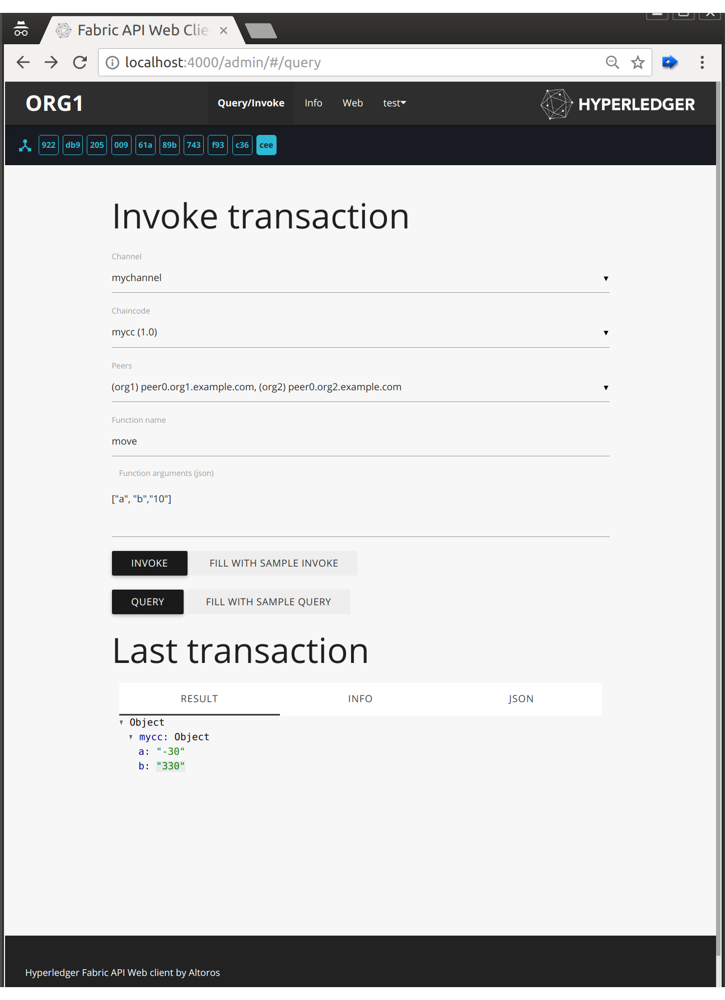

# REST API server for Hyperledger Fabric 1.0

This server provides a convenient REST interface for web applications to transact on 
[Hyperledger Fabric 1.0](https://github.com/hyperledger/fabric) network. 
It uses [Node.js SDK](https://github.com/hyperledger/fabric-sdk-node) API to call peers, orderer and CA servers of 
network's members.

The server can be instantiated from a [docker image](https://hub.docker.com/r/maxxx1313/fabric-rest) and run alongside
other services like peers and ca servers on a member's host.
 
## REST Server

The API server is meant to be run by each member organization. It manages user authentication, interacts with peers and
passes events to the client.

See the example calls in [REST.md](REST.md).

### Authentication

The server connects to the organization's CA server to get certs for end users and passes these certs to authenticate 
to blockchain peers. User requests coming from a web app authenticate with a Bearer JWT token for which the server 
finds a corresponding key cached locally and signs user transactions with it when it passes them to peers.

### Events

Block events coming from peers are sent to clients with a popular [socket.io](https://socket.io/) library to be consumed 
by browser or other clients.

## Admin Web Application 

Admin web application is served from the http endpoint for developers to invoke chaincodes and view transaction and 
block info. Please note that connection to the API server and the test web app is not password protected.

 

## Network
 
A sample network of two organizations and a solo orderer can be started from a 
[docker-compose file](ledger/docker-compose-template.yaml) generated together with crypto material by 
[network.sh](network.sh) setup script. Use this network for testing and development of this project.

To jump start your own application with more robust scripts we recommend 
[fabric-starter app](https://github.com/olegabu/fabric-starter) which uses this server in a docker instance. 

## Prerequisites:

* **Node.js** v6.9.0+
* Same prerequisites as for Fabric: 
  * [Docker](https://www.docker.com/products/overview) - v1.12 or higher
  * [Docker Compose](https://docs.docker.com/compose/overview/) - v1.8 or higher
  * [Git client](https://git-scm.com/downloads) - needed for clone commands


## Setup

[network.sh](network.sh) script will create `docker-compose.yaml`, `configtx.yaml` and `cryptogen.yaml` files with your custom
  org names; will run `cryptogen` to generate crypto material and `configtxgen` for the orderer genesis block and config
  transactions.
  
The network can be started from the generated `docker-compose.yaml` with these docker instances:
  * 2 CAs
  * A SOLO orderer
  * 4 peers: 2 peers per member organization
  
  Once the network is running you can start the API and web app servers. 

```
# generate customized yaml files and generate crypto and channel artifacts
./network.sh -m generate
 
# start the network
./network.sh -m up

# tail the logs
./network.sh -m logs
 
# stop the network
./network.sh -m down
```

Open [http://localhost:4000](http://localhost:4000) for org1 admin web app and 
[http://localhost:4001](http://localhost:4001) for org2.
 
 You can also interact with the API server directly with an http client of your choice and test with these 
 [sample requests](https://github.com/hyperledger/fabric-samples/tree/release/balance-transfer#sample-rest-apis-requests).

## Development

## Run Api in dev mode

Dev mode supports editing source files without rebuilding container (for the most of the files, but not for all of them!). 
For more details see [docker-compose-server-dev.yaml](ledger/docker-compose-server-dev.yaml) file.

```
 docker-compose -f ledger/docker-compose-server-dev.yaml up
```

## Run preset mode

Preset mode uses predefined certificates and configuration.

```
 # start pure ledger and api servers
 docker-compose -f artifacts-preset/docker-compose.yaml up

 # create channel and init with example chaincode
 ./artifacts-preset/init.sh

```

API server for _org1_ and _org2_ become available on port `4001` and `4002` respectively.

_NOTE_ that chaincode instantiation is a long process and may result in a timeout. 
It doesn't mean it's failed. You can see real state in peer logs or by observing `docker ps` 
(ex. `dev-peer0.org2.example.com-mycc-v0` means instantiated chaincode).

## Network configuration

You can change configuration parameters by editing [network-config.json](server/network-config.json). 
All paths in the config file should be absolute or relative to the file.

### IP Address and PORT information

If you choose to customize your docker-compose file by hardcoding IP Addresses and PORT information for your peers 
and orderer, then you MUST also add their values to `network-config.json`. 
The paths shown below will need to be adjusted to match your docker-compose file.

```
		"orderer": {
			"url": "grpcs://x.x.x.x:7050",
			"server-hostname": "orderer0",
			"tls_cacerts": "../artifacts/tls/orderer/ca-cert.pem"
		},
		"org1": {
			"ca": "http://x.x.x.x:7054",
			"peer1": {
				"requests": "grpcs://x.x.x.x:7051",
				"events": "grpcs://x.x.x.x:7053",
				...
			},
			"peer2": {
				"requests": "grpcs://x.x.x.x:7056",
				"events": "grpcs://x.x.x.x:7058",
				...
			}
		},
		"org2": {
			"ca": "http://x.x.x.x:8054",
			"peer1": {
				"requests": "grpcs://x.x.x.x:8051",
				"events": "grpcs://x.x.x.x:8053",
				...			},
			"peer2": {
				"requests": "grpcs://x.x.x.x:8056",
				"events": "grpcs://x.x.x.x:8058",
				...
			}
		}

```

### Discover IP Addresses

To retrieve the IP Address for one of your network entities, issue the following command:

```
# this will return the IP Address for peer0
docker inspect peer0 | grep IPAddress
```

## Acknowledgements

Based on the sample app [balance transfer](https://github.com/hyperledger/fabric-samples/tree/release/balance-transfer).
